```{r setup, include=FALSE}
library(magick)

library(ggplot2)

options(htmltools.dir.version = FALSE)

knitr::opts_chunk$set(echo=FALSE)

crop <- function(im, left = 0, top = 0, right = 0, bottom = 0) {
  d <- dim(im[[1]]); w <- d[2]; h <- d[3]
  image_crop(im, glue::glue("{w-left-right}x{h-top-bottom}+{left}+{top}"))
}

```


class: center, middle

# About me


.pull-left[BA and MSC from Department of Sociology, University of Copenhagen(graduated 2016)]

.center[

```{r, out.width = "100px"}
knitr::include_graphics("https://designguide.ku.dk/download/co-branding/ku_logo_dk_hh.png")
```
]


<br /> 


.pull-left[Worked at VIVE - The Danish Center for Social Science Research since 2016]

.center[

```{r, out.width = "100px"}
knitr::include_graphics("https://silkeborgbib.dk/sites/silkeborg.ddbcms.dk/files/styles/ding_secondary_large/public/title_image/eresource/vive_-_stor.png?itok=2xRibkp-")
```


]

<br /> 


.pull-left[Worked a lot with systematic litterature review and meta-analysis]

.center[


```{r, out.width = "300px"}
#knitr::include_graphics("forestPQ.png")

image_read("forestPQ.png") %>%
  crop(top = 510)

```


]

---

# About me

Currently a Ph.D student jointly at VIVE and Department of Sociology

Works on teacher sorting and teacher mobility 

.pull-left[

```{r DAG, out.width="300px"}

DiagrammeR::grViz("
      digraph mrdag {

      graph [rankdir=TB]

      node [shape=ellipse]
      U [label='School characteristics']

      node [shape=box, height=0.3, width=0.3]
      X [label='Teacher sorting']
      Y [label='Student outcomes']

      { rank = same; X Y }

      U -> X
      U -> Y
      X -> Y [minlen=3]
      }
      ", height = 200)

```

]

.pull-right[

```{r, out.width = "500px", fig.cap="change in distance to nearest teacher training college(TTC) after 11 TTCs closed down"}
knitr::include_graphics("schooldistplot.png")
```


]

---

# Any questions about the lecture?


---


# what was the hardest thing you had to learn in stats I?

5 min discussion with partner(s)

group discussion afterwards


---

# Break

15 mins!


---

# What would you like the tutorials to be about

5 min discussion with partner(s)

group discussion afterwards

## Last time was...

What was nice and not so nice about the tutorials last time?

## This time around we'd like more..

Going over hard stuff from lectures/texts one(or ten) more time(s)?

Doing practical stuff in R?

Something else?

---

# What are you going to be learning this time

---

## Multiple regression

Powerful!!

Now you can adjust for confounders that would otherwise bias your estimate!


      
```{r DAG_confound}

DiagrammeR::grViz("
      digraph mrdag {

      graph [rankdir=TB]

      node [shape=ellipse]
      U [label='Cultural capital of parents']

      node [shape=box, height=0.3, width=0.3]
      X [label='Education']
      Y [label='Salary']

      { rank = same; X Y }

      U -> X [color=red]
      U -> Y [color=red]
      X -> Y [minlen=3]
      }
      ", height = 200)

```
      
---

### in R

```{r confound_model}

cul.cap <- rnorm(1000)

education <- rnorm(1000)+3*cul.cap


salary <- 10*education+7.6*cul.cap+rnorm(1000)

df <- data.frame(salary=salary, education=education, cul_cap=cul.cap)


```


```{r regression_models, echo=TRUE}

lm.naive <- lm(salary~education, data=df)

lm.adjust <- lm(salary~education+cul_cap, data=df)


```

Because we cheated and made up some data, we know that the true effect of education on salary is 10. 

But if we estimate a naive association between salary and education the estimate of the effect is `r lm.naive$coefficients["education"]`.

if we adjust for cultural capital of parents, the estimated effect is `r lm.adjust$coefficients["education"]`


---

### Polynomial terms

Linear regression assumes that associations are linear, i.e. a straight line

but what if they are not linear?

What if the association actually looks like this?

```{r poly_model}

x <- rnorm(1000)

y <- 10*x+5*x^2+rnorm(1000)

df <- data.frame(y=y, x=x)


```


```{r poly_plot, out.width="400px"}

p <- ggplot(data=df, aes(x,y))
p <- p+geom_jitter()
p

```
---

Then we'd need a model with a polynomial term. In practial sense that means that we include $x^2$ in the model like this


### in R

```{r regression_models_poly, echo=TRUE}

lm.lin <- lm(y~x, data=df)

lm.poly <- lm(y~x+I(x^2), data=df)


```

```{r get fits}

fitted.lin <- fitted(lm.lin)

fitted.poly <- fitted(lm.poly)

df$fitted_lin <- fitted.lin 

df$fitted_poly <- fitted.poly 


```


---

The red line is the model with only $x$ and the green curve is from the model that also includes $x^2$. Including $x^2$ was clearly a good choice

```{r plot_fitted}

p <- ggplot(data=df, aes(x,y))
p <- p+geom_jitter()
p <- p+geom_point(data=df, aes(x,fitted_lin), color="red")
p <- p+geom_point(data=df, aes(x,fitted_poly), color="green")
p

```


---

### Interaction terms

What if the effect of something is not the same for everyone? What if getting a college degree is more impactful for people from a working class background than those from an affluent background?

```{r int_model}

education <- rnorm(1000)

class <- rbinom(1000, 1,.5)


salary <- 10*education+7.6*class+4.5*(class*education)+rnorm(1000)

df <- data.frame(salary=salary, education=education, class=class)

df$class <- ifelse(class==1, "working class", "affluent")


```

.pull-left[
```{r int_plot, out.width="400px"}

p <- ggplot(data=df, aes(education,salary, color=class))
p <- p+geom_jitter()
p

```
]


.pull-right[

### in R

```{r regression_models_int, echo=TRUE}


lm.int <- lm(salary~education+class+class*education, data=df)


```

]

---

## Causal inference

---

### Randomized controlled trials

The gold standard! 

Nearly a requirement in medical sciences, but not so much in social science. They are becoming more popular however

<!--  -->

```{r rcts_plot, out.width = "500px", fig.cap='Number of RCTs in education research Connolly, Paul, Ciara Keenan, and Karolina Urbanska. "The trials of evidence-based practice in education: A systematic review of randomised controlled trials in education research 1980–2016." Educational Research 60.3 (2018): 276-291.'}
knitr::include_graphics("rct_education.png")
```


Yields, on average, an unbiased estimate with minimal assumptions


---

### Instrumental variable(IV)

What if you can't do an RCT? 

For some reason, no one wants to fund a study in which we randomly select teenagers to pick up smoking.

Maybe there is a different way to go about it? 

```{r DAG_iv_smoke}

DiagrammeR::grViz("
      digraph mrdag {

      graph [rankdir=TB]

      node [shape=ellipse]
      U [label='Unobserved confounders']
      

      node [shape=box, height=0.3, width=0.3]
      X [label='Smoking']
      Y [label='Mortality']
      Z [label='tobacco law']

      { rank = same; X Y }

      U -> X [color=red]
      U -> Y [color=red]
      X -> Y [minlen=3]
      Z -> X
      }
      ", height = 200)

```
---
 
 
<!--  -->

```{r ea_iv, out.width = "500px"}
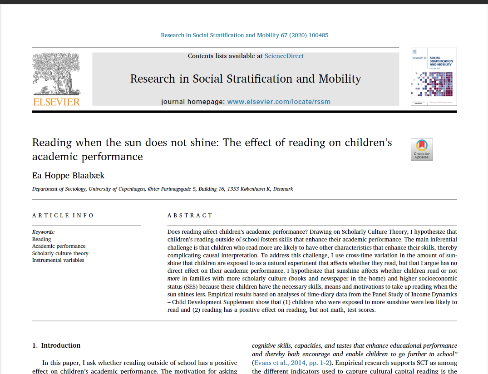
```


```{r DAG_iv_ea}

DiagrammeR::grViz("
      digraph mrdag {

      graph [rankdir=TB]

      node [shape=ellipse]
      U [label='Unobserved confounders']
      

      node [shape=box, height=0.3, width=0.3]
      X [label='reading in spare time']
      Y [label='reading score']
      Z [label='sun is shining']

      { rank = same; X Y }

      U -> X [color=red]
      U -> Y [color=red]
      X -> Y [minlen=3]
      Z -> X
      }
      ", height = 200)

```

### in R

---

### Regression discontinuity 

Like IV, a method that utilizes "natural experiments".

This method relies on some kind of "cutoff" that determines who gets "treated" and who do not

The central idea is that, individuals close just above and just below the cutoff can function as treatment and control groups

e.g. GPA threshold for college admissions in DK

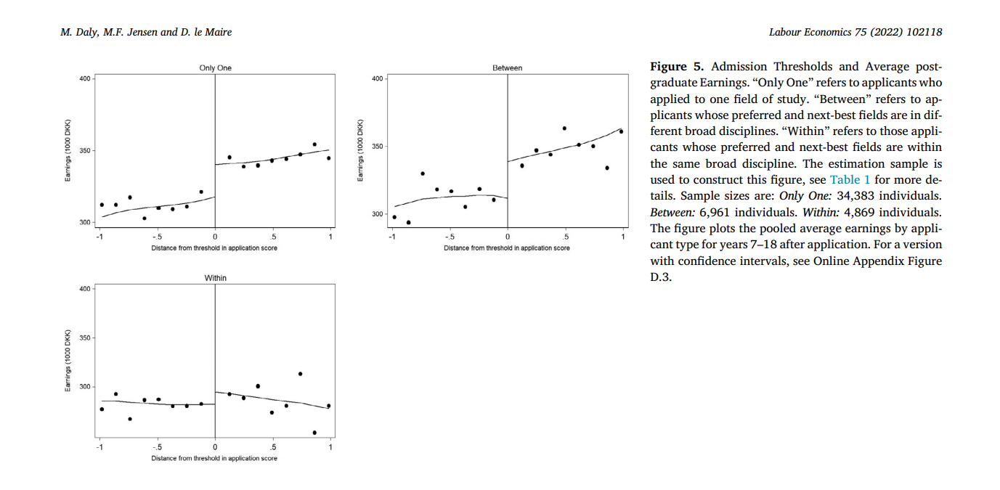


---

## (Applied) statistical (analysis) literacy


---

### Correlation is not causation

.pull-left[

[Rapport om indvandreres ægteskaber kløjes i svar på, hvordan det går med integrationen](https://www.tjekdet.dk/faktatjek/rapport-om-indvandreres-aegteskaber-kloejes-i-svar-paa-hvordan-det-gaar-med-integrationen)

<!-- 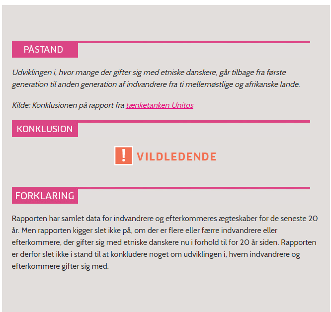 -->

```{r unitos_1, out.width = "500px"}

```


<!-- 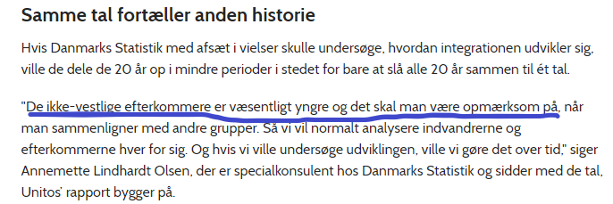 -->

```{r unitos_2, out.width = "500px"}

```


]

.pull-right[

[Partileder ført på afveje af kringlet sætning om unge kriminelle indvandrere](https://www.tjekdet.dk/faktatjek/partileder-foert-paa-afveje-af-kringlet-saetning-om-unge-kriminelle-indvandrere)

<!-- 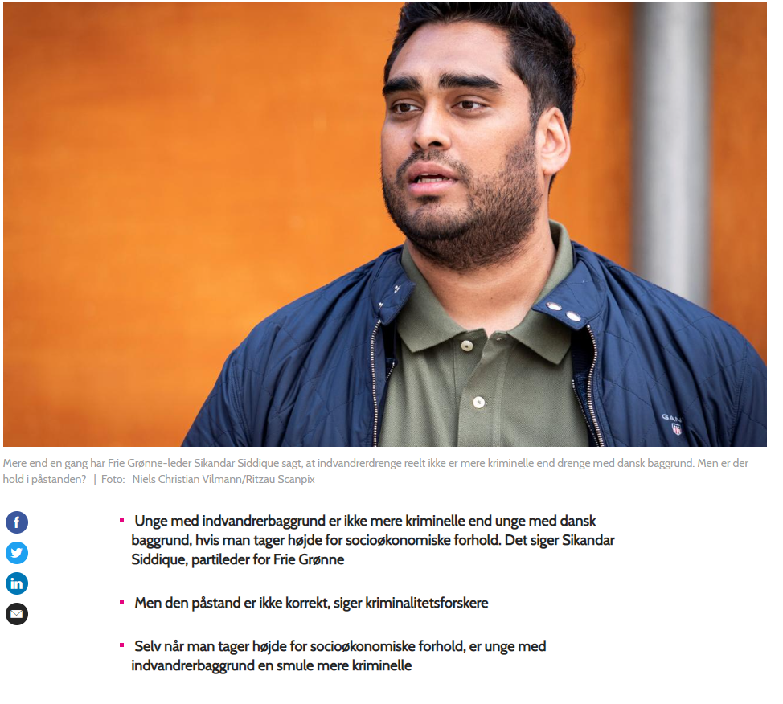 -->

```{r sikandar 1, out.width = "500px"}

```


<!-- 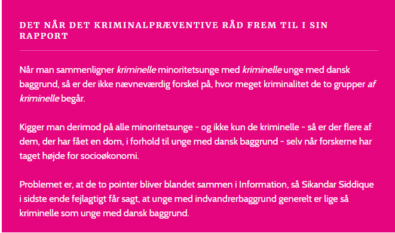 -->


```{r sikandar 2, out.width = "500px"}

```


]

---


### All models are wrong and all estimates are uncertain

.center[_All models are wrong, but some are useful_]

.center[George Box]

<!-- 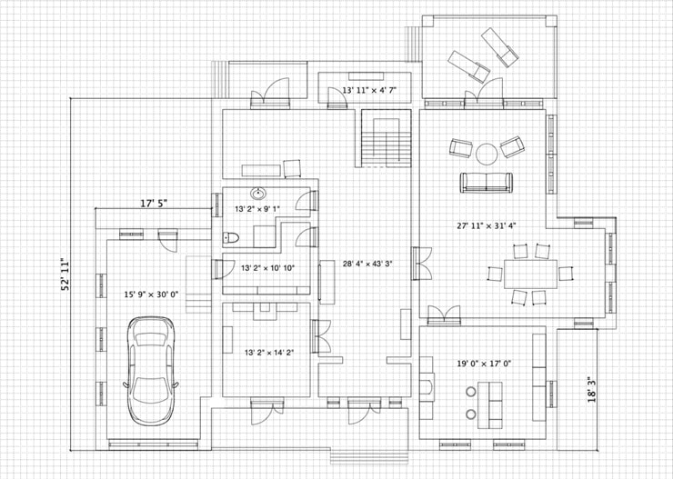 -->


```{r house_model, out.width = "500px"}

```


---

<!-- 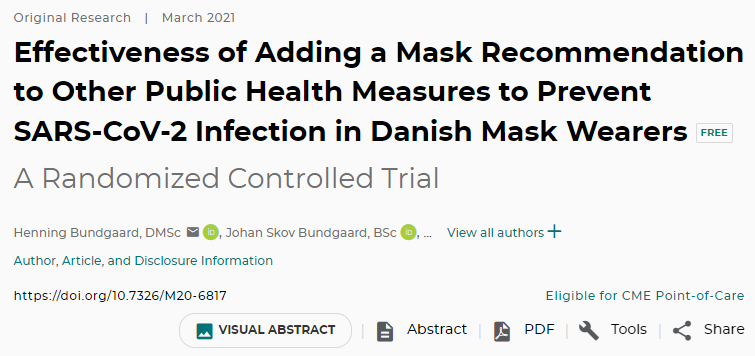 -->

```{r danmask1, out.width = "500px"}

```


<!-- 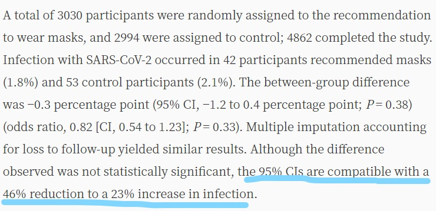 -->

```{r danmask2, out.width = "500px"}

```


---

<!-- 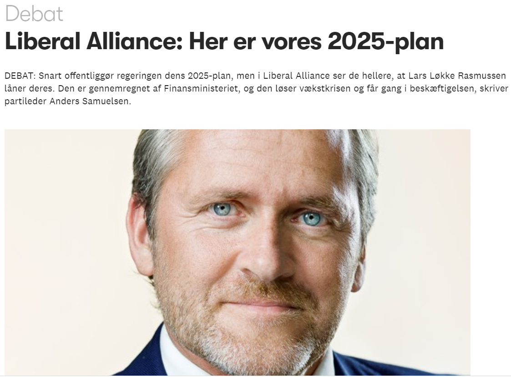{width=250px} -->

```{r la_sikker, out.width = "700px"}

```


---

.left[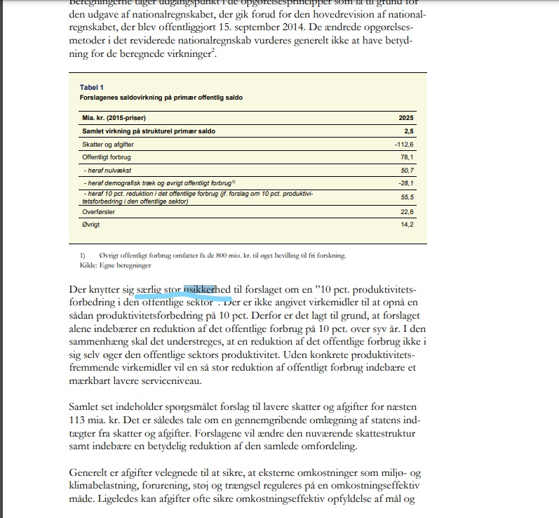]

---

.center[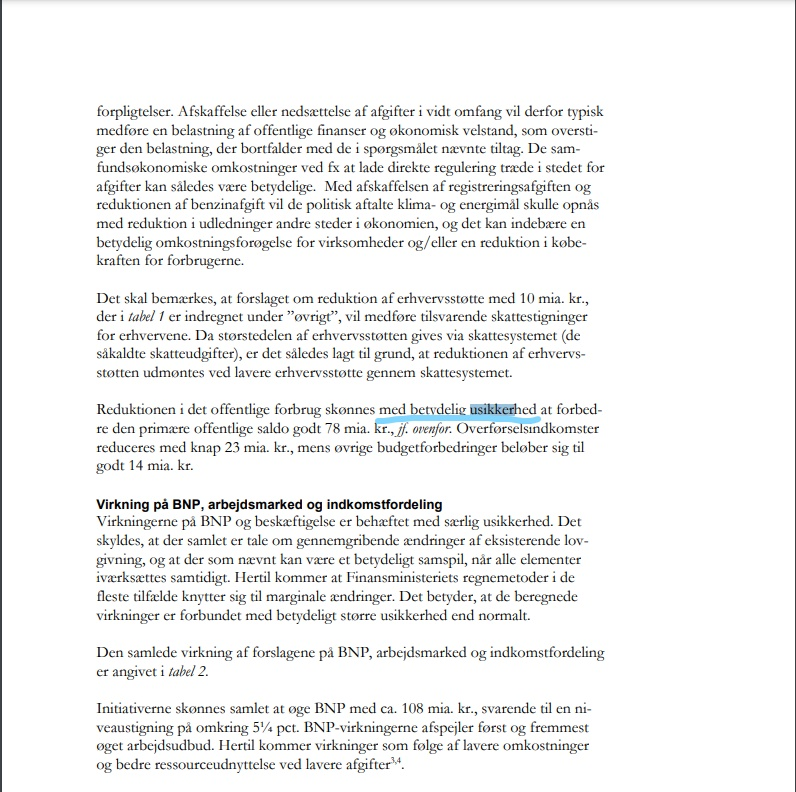]

---

.right[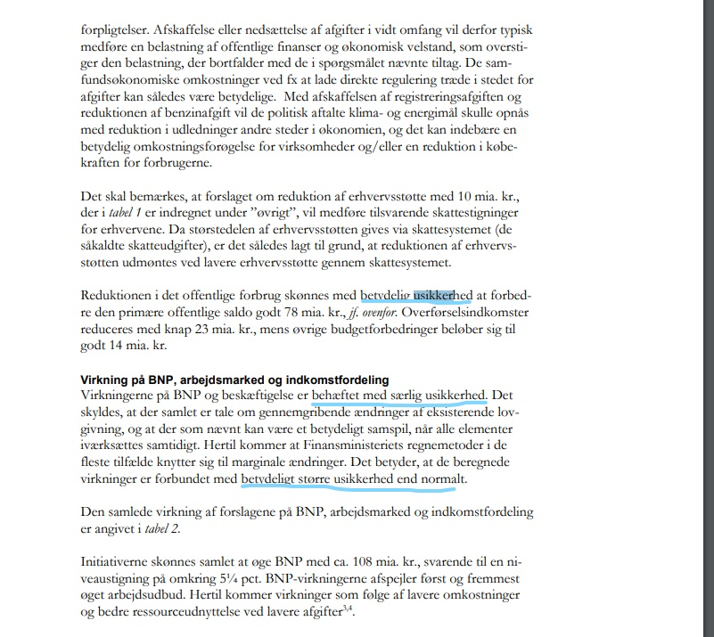]


---

# That's it, see you next week!!

## Any questions outside tutorials?

rhk@vive.dk

rhk@soc.ku.dk


