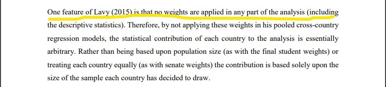
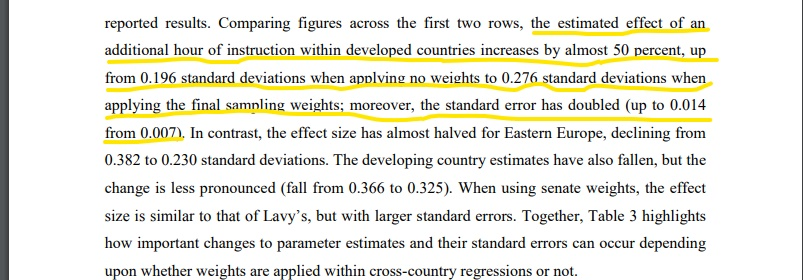

class: center, middle


```{r setup, include=FALSE}
library(magick)

library(ggplot2)

library(patchwork)

library(democracyData)

library(dplyr)

library(tidyr)

library(haven)

library(kableExtra)

library(flextable)

library(patchwork)

library(estimatr)

library(stargazer)


options(htmltools.dir.version = FALSE)

knitr::opts_chunk$set(echo = FALSE, warning = FALSE, message=FALSE, dpi=300)

crop <- function(im, left = 0, top = 0, right = 0, bottom = 0) {
  d <- dim(im[[1]]); w <- d[2]; h <- d[3]
  image_crop(im, glue::glue("{w-left-right}x{h-top-bottom}+{left}+{top}"))
}


theme_set(theme_minimal(base_size = 16,base_family = "serif")+ theme(axis.line = element_line(color='black'),
    plot.background = element_blank(),
    panel.grid.major = element_blank(),
    panel.grid.minor = element_blank(),
    panel.border = element_blank()))


#load data

ESS <- read_spss("C:/Users/B059064/Desktop/PHD/teaching/advanced stats/ESS9e03_1.sav") %>%
  filter(cntry == "DK") %>% # Keep only the Danish data,
  # Keep only a minimum set of variables we need today,
  select(idno, pspwght, gndr, eduyrs, agea, 
         psppsgva, trstlgl, trstplc) %>%
  drop_na() # Delete cases with missing values.

ESS <- ESS %>% mutate(
  psppsgva = zap_labels(psppsgva), # Make numeric
  eduyrs = case_when( # Censor years of education at 9 & 21 years.
    eduyrs > 21 ~ 21,
    eduyrs < 9 ~ 9,
    TRUE ~ as.numeric(eduyrs)),
  gndr = as_factor(gndr)) # Make factor


```


```{css, echo=FALSE}
.strike {
  text-decoration: line-through
}
```


```{css, echo=FALSE}
.watch-out {
  background-color: lightpink;
  border: 3px solid red;
  font-weight: bold;
}
```


```{r get_data}

# Dat_citi_rights <- download_fh(verbose = FALSE) %>% # Download Freedom House data for all countries since 1972,
#    rename(country = fh_country, # rename country ID,
#           citizen_rights = fh_total_reversed, # rename Citizenship rights indicator,
#           date = year)

```


# Spørgsmål til undervisningen?


---

# Tilfældig stikprøve

## Gallup vs. Literary Digest

Gallup og avisen _The literary digest_ prøvede begge at forudsige præsident valget i 1936

Stikprøve størrelse - Literary Digest = 2,4 mill 

Stikprøve størrelse - Gallup = 50.000

--

## Hvor mange stemmer på Roosevelt?

Literary Digest: 43%

Gallup: 56%

--

Roosevelt fik 61% af stemmerne

---

Stikprøven som Literary Digest havde benyttet sig af var _ikke_ en tilfældigt udtrukket stikprøve. 

Avisen havde spurgt blandt sine mange, men konservativt orienterede, læsere. 

Yderligere havde avisen anvendt lister med telefonnumre og registrering af biler på et tidspunkt, hvor hverken telefoner eller biler var hvermandseje. 

Ydermere var det kun ca. 25% som besvarede deres survey.


---

## Survey vægte

Survey vægte kan være enormt vigtige, og i flere tilfælde en integreret del af stikprøvedesignet

Store surveyundersøgelser, eks. TIMMS, PISA, ESS, EUropean Values Survey osv. Kommer typisk med et sæt survey vægte, som skal bruges for at rette op på skævheder i stikprøven

---


```{r pisa weights 1, out.width="600px"}



```


```{r pisa weights 2, out.width="600px"}



```


Jerrim, John and Lopez-Agudo, Luis and Marcenaro-Gutierrez, Oscar D. and Shure, Dominique, What Happens When Econometrics and Psychometrics Collide? An Example Using the PISA Data. IZA Discussion Paper No. 10847, Available at SSRN: https://ssrn.com/abstract=2998956 or http://dx.doi.org/10.2139/ssrn.2998956

---

### Vægtning i meninsgmålinger

Et sted, hvor i helt sikkert er blevet "udsat" for vægtede gennemsnit er når i læser en meningsmåling

```{r lastelecvote}

#actual distribution of votes last election

parties <- c("A. Socialdemokratiet" ,"V. Venstre, Danmarks Liberale Parti", "O. Dansk Folkeparti",
             "B. Radikale Venstre", "F. SF - Socialistisk Folkeparti", "Ø. Enhedslisten - De Rød-Grønne")

vote.perc <- c(25.9, 23.4,8.7,8.6,7.7,6.9)

vote.perc <- vote.perc/sum(vote.perc)

#how did people in our sample vote?

partici.perc <- t(rmultinom(1000,1,prob=c(.22,.17,.05, .15, .20, .21)))

colnames(partici.perc) <- parties

participated <- colSums(partici.perc)/nrow(partici.perc)

#how will people in our sample vote this time?

votenow.perc <- t(rmultinom(1000,1,prob=c(.15,.07,.03, .20, .25, .3)))

colnames(votenow.perc) <- parties

willvote <- colSums(votenow.perc)/nrow(votenow.perc)


#how skewed is our sample?

#we make the weights according to how skewed the sample is. ex in the last election 31,8% of people
#voted for soc. dems., but in out sample only 22% of people voted for soc. dems. In that case
#people who voted for soc. dems. last time, in our sample, will receive a weight of 31,8/22=1,44.
#that is, we multiply the responses of people who said they voted for soc.dems the last time by 1,44

rep.weight <- vote.perc/participated

#apply the weights

willvote.weighted <- lapply(1:ncol(votenow.perc), function(x){
  
  votenow.perc[,x]*rep.weight[x]
  
})

willvote.weighted <- do.call("cbind", willvote.weighted)

colnames(willvote.weighted) <- parties


willvote.weighted.percs <- colSums(willvote.weighted)/nrow(willvote.weighted)


```

Lad os tage et eksempel: Vi har været ude og spørge folk 2 spørgsmål

1. Hvilket parti stemte du på ved sidste folketingsvalg?
2. Hvis der var folketingsvalg imorgen hvem ville du så stemme på?

---

Og resultaterne er:

```{r results_unweighted, out.width="600px"}

df <- data.frame(parti=parties, perc=willvote)


p <- ggplot(data=df, aes(parti,perc))
p <- p+geom_bar(stat="identity")
p <- p+theme(axis.text.x = element_text(angle = 45, vjust=1, hjust=1.2))
p


```


---

#Hvad stemte vores stikprøve på ved sidste valg?

```{r votecomp, out.width="500px"}

df <- data.frame(perc=c(participated, vote.perc), sample=c(rep("sample", 6), rep("DK", 6)), parti=rep(parties,2))

p <- ggplot(data=df, aes(parti,perc, fill=sample))
p <- p+geom_bar(stat="identity", position="dodge")
p <- p+theme(axis.text.x = element_text(angle = 45, vjust=1, hjust=1.2))
p

```
Ok det er vist ret tydeligt at vores stikprøve er mere venstrorienteret end gennemsnittet

---

# Find vægte

Hvordan kan vi lave nogle vægte der korrigerer for den skævhed?

Vi kunne eksempelvis se hvor mange færre der stemte Soc. Dem. ved sidste valg i vores stikprøve versus hvor mange der gjorde det i DK

I vores Danmark stemte `r round(vote.perc[1],2)*100`% på Soc. Dem. ved sidste valg, mens `r round(participated[1],2)*100`% gjorde det i vores stikprøve. 

---

# Find vægte

Hvis vi skal rette op på, at vi har for få i vores stikprøve som stemte på Soc. Dem. ved sidste valg, så skal dem der stemte soc. dem. ved sidste valg i vores stikprøve have _mere vægt_ end de har nu. 

## Hvor meget mere skal deres svar vægte?

Hvor mange stemte Soc. Dem. i DK / Hvor mange stemte soc. dem. i vores stikprøve = `r paste(round(vote.perc[1],2), "/", round(participated[1],2))`  = `r paste(round(vote.perc[1]/participated[1],2))` 

--

I praksis betyder det, at alle svar som er afgivet af dem som stemte Soc. dem. ved sidste valg bliver ganget med `r round(vote.perc[1]/participated[1],2)`

```{r weights ex}


votenow.perc.ex <- as.data.frame(t(rmultinom(10,1,prob=c(.50,.1,.1, .1, .1, .1))))

colnames(votenow.perc.ex) <- parties

votenow.perc.ex$soc_dem_weight <- vote.perc[1]/participated[1]


votenow.perc.ex.weighted <- cbind(votenow.perc.ex$`A. Socialdemokratiet`*votenow.perc.ex$soc_dem_weight, votenow.perc.ex[2:ncol(votenow.perc.ex)])


```

---

Hvordan ser vægtene ud for resten af partierne?

```{r compute weights}

#cat(paste(parties, vote.perc/participated))

weight.df <- data.frame(parti=parties, stemte_sidst_DK=vote.perc, stemte_sidst_stikprøve=participated, "vægt=stemte_sidst_DK/stemte_sidst_stikprøve"=vote.perc/participated)

knitr::kable(weight.df[2:ncol(weight.df)], col.names = c("stemte sidst DK", "stemte sidst stikprøve", 
                                                         "vægt=stemte sidst DK / stemte sidst stikprøve"))


```

---

Hvis vi så vægter alle besvarelserne får vi

```{r weight_results, out.width="600px"}


df.weighted <- data.frame(perc=c(willvote, willvote.weighted.percs), weights=c(rep("unweighted", 6), rep("weighted", 6)), parti=rep(parties,2))

p <- ggplot(data=df.weighted, aes(parti,perc, fill=weights))
p <- p+geom_bar(stat="identity", position="dodge")
p <- p+theme(axis.text.x = element_text(angle = 45, vjust=1, hjust=1.2))
p

```

---

<!-- ### Vægtet gennemsnit -->

<!-- Et vægtet gennemsnit er et gennemsnit hvor observationer har forskellige vægte -->

<!-- normalt har alle observationer vægten $\frac{1}{n}$ -->


---

# Sample selection vs. confounding

.left-column[

Selv, hvis du ikke behøver at kontrollere for bagvedliggende årsager, så skal man stadig tage højde for stikprøve selektion

Selv hvis du har taget højde for stikprøveselektion skal du stadig tage højde for bagvedliggende årsager.

]

.right-column[

Hvad nu hvis folk med lav indkomst og folk med høj indkomst slet ikke gider at deltage i vores survey?

```{r no_confounding_but_sample_selection, out.width="400px", dpi=300}
ed <- runif(100000, 5,21)


salary <- 100+10*ed+rnorm(100000,0,10)

df <- data.frame(salary=salary, ed=ed)

#summary(lm(salary~ed, data=df))

q20 <- quantile(salary, probs=seq(0,1,.05))[5]

q80 <- quantile(salary, probs=seq(0,1,.05))[19]

df$select <- as.factor(ifelse(df$salary>q20&df$salary<q80, 1,0))


df.select <- df[df$select==1,]


df$alpha <- ifelse(df$select==1, .3,1)


p <- ggplot(data=df, aes(ed,salary, color=select, alpha=.3))
p <- p+geom_jitter()
p <- p+geom_smooth(method="lm", color="blue")
p <- p+geom_smooth(data=df.select, aes(ed,salary), method="lm", color="red")
p <- p+annotate("text", x = 22, y = 320, label = "True", color="blue")
p <- p+annotate("text", x = 22.3, y = 295, label = "sample \n selection", color="red")
#p <- p+scale_color_manual(values=c("#6ff5a8","#c8ec5a"))
p <- p+xlim(5,25)
p

```
]

---

# sampling error


Selv med en tilfældig stikprøve og ingen bagvedliggende faktorer kan vi stadig være uheldige at trække en stikprøve som giver et forkert estimat. 

Hvis vi trækker en dårlig stikprøve fordi vi var uheldige, så var det _tilfældigt_ at vi fik et forkert estimat. Den slags fejl kalder man stikprøve-fejl eller _sampling error_ 

---

# sampling error


Sampling error dækker over, at vi, _tilfældigt_, kan ende med at stå med en stikprøve som rammer forkert. 

Jo mindre stikprøven er, jo større sandsynlighed er der for at vi, _tilfældigt_, kan ende med en stikprøve der er helt skæv.


<!-- Det er som er RIGTIG smart ved tilfældige fejl, er at de forsvinder over tid. Ligesom når man kaster en terning. Vi ved, at du kan være rigtig uheldig og slå en etter fem gange i træk, og så kunne man jo tro at sandsynligheden for at slå en etter var meget højere end sandsynligheden for at slå en toer,treer,firer,femmer eller en sekser. Men hvis vi slår terningen nok gange finder vi ud af at sandsynligheden for at slå både en etter, toer, treer, firer, femmer eller sekser er 1/6.  -->

---

# terningskast øvelse

https://www.random.org/dice/


---

# Hvad er forskellen på standardafvigelsen og standardfejlen?

<!-- Ok så vi ved at vi pga. tilfældigheder kan ende med en stikprøve der faktisk ikke giver det rigtige resultat. Hvis vi havde havde mange stikprøver kunne vi bare tage gennemsnittet af hvert af stikprøvernes genemsnit og så var det løst -->

<!-- _Til gengæld_ ved vi også, at den slags fejl ville blive "glattet" ud, hvis vi kunne tage en masse stikprøver og tage gennemsnittet af deres gennemsnit.  -->

<!-- Problemet med stikprøver er, at vi normalt ikke kan gå ud og tage den _samme_ tilfældige stikprøve igen indtil de tilfældige fejl glatter sig ud.  -->

<!-- Men hvad nu hvis vi kunne? -->

Standardafvigelsen = Spredningen på data i din _stikprøve_

Standardfejlen = Et mål for den _statistiske usikkerhed_ på dit estimat, eks. estimatet for den gennemsnitlige længde på uddannelse. 


--

men

--

Standardfejlen er en speciel standardafvigelse


---

# Hvad var det nu en standardafvigelse var?

lad os beregne SD for en af vores stikprøver

```{r sd of sample, echo=TRUE}

samp <- ESS[sample(1:nrow(ESS),10),] 

sd.df <- data.frame(eduyrs=samp$eduyrs, mean_eduyrs=mean(samp$eduyrs), 
                    "mean-eduyrs^2"=(mean(samp$eduyrs)-samp$eduyrs)^2, 
                    "var=mean(mean-eduyrs^2)"=mean((mean(samp$eduyrs)-samp$eduyrs)^2),
                    "sd=sqrt(var)"=sqrt(mean((mean(samp$eduyrs)-samp$eduyrs)^2)))


```


---


```{r collapse rows}


ft <- flextable(sd.df)

ft <- set_header_labels(ft,
  edyrs = "eduyrs",
  mean_eduyrs = "mean eduyears", 
  mean.eduyrs.2 = "mean(eduyrs)-eduyrs^2",
  var.mean.mean.eduyrs.2. = "var=mean(mean-eduyrs^2)",
  sd.sqrt.var.="sd=sqrt(var)"
)

ft <- compose(ft, i = 1, j = 3, part = "header",
    value = as_paragraph(
      "(mean(eduyrs)-eduyrs)",
      as_sup("2")
    ) )

formula <- "(var=mean(mean-eduyrs^2))"

  ft <- compose(ft, part = "header", j = 4, i=1, 
          value = as_paragraph("var=mean((mean-eduyrs)", as_sup("2"), ")")) 
  
   ft <- compose(ft, part = "header", j = 5, i=1, 
          value = as_paragraph("sd=\U221A(var"))
   

ft <- merge_v(ft, j = c(4,5))

ft <- width(ft, j = NULL, 35, unit = "in")

ft


```


---

# Men hvad er så standardfejlen

Ok, lad os prøve at tage 10 tilfældige stikprøver fra ESS...

```{r take_10_samples, out.width="600px", dpi=300}


colors <- c("#8650a6",
            "#62a352",
            "#b64468",
            "#98ad3d",
            "#b95493",
            "#cc8c34",
            "#6880d8",
            "#a8803f",
            "#46c19a",
            "#b94c3f")

samp <- ESS[sample(1:nrow(ESS),50),]

samps.means <- lapply(1:10, function(x){
  
  #cat(paste("iter", x, "\r"))
  
  #x <- 10
  
  samp <- ESS[sample(1:nrow(ESS),50),]
  

  mean <- mean(samp$eduyrs)
  
  sd <- sd(samp$eduyrs)
 
  plot <- ggplot(samp, aes(eduyrs))
  plot <- plot+geom_histogram(fill=colors[x])
  plot <- plot+ggtitle(paste("sample", x))

  
  res.df <- data.frame(mean=mean, sd=sd, color=colors[x], sample=x)
  
  results <- list(res.df,plot)
  
  return(results)
  
  
})


```


```{r plot_the_samples, out.width="400px", dpi=300}

plots <-lapply(samps.means,'[[',2)


wrap_plots(plots)

```


---

 ...Som hver har et gennemsnit og en standardafvigelse
 
--

Figuren her viser de 10 gennemsnit fra hver af de 10 stikprøver, og hvordan de fordeler sig omkring gennemsnittet af gennemsnittene(den lige vertikale linje)

.pull-left[

```{r}

dfs <-lapply(samps.means,'[[',1)

dfs <- do.call("rbind", dfs)


p <- ggplot(dfs, aes(mean, sample, color=as.factor(sample), label=sample))
p <- p+geom_text(size=10)
p <- p+geom_vline(xintercept=mean(dfs$mean))
p <- p+scale_color_manual("sample", values = colors)
p

```

]

.pull-right[


Og her er de samme data i en tabel


```{r}

knitr::kable(dfs[c(1,2,4)])


```
]

---

## Standardafvigelsen for gennemsnittene fra de ti stikprøver

Nu hvor vi har trukket 10 stikprøver har vi ikke længere kun et enkelt gennemsnit, men _en fordeling_ af gennemsnit. 

Den fordeling kan vi beregne spredningen af

```{r}

sd.df.samps <- data.frame(sample_means=dfs$mean, mean_of_means=mean(dfs$mean), 
                    "(mean of means-mean)^2"=(mean(dfs$mean)-dfs$mean)^2, 
                    "var_means=mean((mean of means-mean)^2)"=mean((mean(dfs$mean)-dfs$mean)^2),
                    "sd_means=sqrt(var_means)"=sqrt(mean((mean(dfs$mean)-dfs$mean)^2)))


ft <- flextable(sd.df.samps)

ft <- set_header_labels(ft,
  sample_means = "sample means",
  mean_of_means = "mean of sample means", 
  X.mean.of.means.mean..2 = "(mean of means-means)^2",
  var_means.mean..mean.of.means.mean..2. = "var means=mean((mean of means-mean)^2)",
  sd_means.sqrt.var_means.="sd means=sqrt(var means)"
)

ft <- compose(ft, i = 1, j = 3, part = "header",
    value = as_paragraph(
      "(mean of means-mean)",
      as_sup("2")
    ) )

formula <- "(var=mean(mean-eduyrs^2))"

  ft <- compose(ft, part = "header", j = 4, i=1, 
          value = as_paragraph("var means=mean((mean of means-mean)", as_sup("2"), ")")) 
  
   ft <- compose(ft, part = "header", j = 5, i=1, 
          value = as_paragraph("sd means=\U221A(var means"))
   
     

ft <- merge_v(ft, j = c(4,5))

ft <- width(ft, j = NULL, 35, unit = "in")


ft


```

---

# Og der var den..

standardafvigelsen af gennemsnittene fra de forskellige stikprøver er spredningen af stikprøvernes gennemsnit omkring gennemsnittet af stikprøvernes gennemsnit

--

og det er..

--

..standardfejlen

---


Problemet ved standardfejlen er, at vi nok aldrig kommer til at gå og trække mange ens stikprøver

Med andre ord kommer vi nok _aldrig til nogensinde faktisk at observere en fordeling af gennemsnit fra gentagne stikprøver_

Og derfor kommer vi heller _aldrig til at kunne beregne den faktiske standardfejl_


---

# Kan vi estimare standardfejlen?

Men vi kan heldigvis estimere standardfejlen. For at estimere standardfejlen beregner vi

$$\frac{SD(eduyrs)}{\sqrt{n}}$$


```{r draw more samples}


samps.means.many <- lapply(1:1000, function(x){
  
  #cat(paste("iter", x, "\r"))
  
  #x <- 10
  
  samp <- ESS[sample(1:nrow(ESS),50),]
  

  mean <- mean(samp$eduyrs)
  
  sd <- sd(samp$eduyrs)
  
  res.df <- data.frame(mean=mean, sd=sd)
  
  
  
  return(res.df)
  
  
})


samps.df.many <- do.call("rbind", samps.means.many)

```


## sammenlign med den faktiske standardfejl

```{r estimated SE, echo=TRUE}


std <- function(x) sd(x)/sqrt(length(x))

#std(samp$eduyrs)

#sd(samps.df.many$mean)

cat(paste("den estimerede standardfejl er", std(samp$eduyrs), "\n"
, "den sande standardfejl er", sd(samps.df.many$mean)
))

```


Ok så det er ikke helt lige på skiven, men det er altså heller ikke meget ved siden af!

---

## Hvad skal vi med standardfejlen

OK så vi vi ved, at hvis vi tager en stikprøve kan vi være rigtig uheldige. Hvad kan vi så gøre med den ene stikprøve vi har?

Det er her at standardfejlen er RIGTIG smart! Selvom vi kun har en enkelt stikprøve så kan vi altså estimere, hvor meget vores estimat kunne have ændret sig hvis vi havde udtrukket en 2., 3., 4., 5., 6., osv. stikprøve


<!-- # Hvad hvis nu vi havde RIGTIG mange penge og magiske kræfter? -->


<!-- simulation -->


<!-- --- -->

<!-- ## Fordelingen af gennemsnit/estimater på tværs af gentagne stikprøver=stikprøvefordelingen -->

<!-- Afvigelsen af de enkelte estimater af gennemsnittet/andre estimater fra gennemsnittet af de estimerede gennemsnit/estimater(det sande gennemsnit) -> variansen af stikprøvefejlene -->

<!-- Variansen af stikprøvefejl -> et mål for hvor usikkert et estimat er, når det kommer fra en stikprøve -> et mål for den statistiske usikkerhed -->

<!-- lille, gennemsnitlig, afvigelse fra det sande gennemsnit -> lille varians -> lav usikkerhed -->

<!-- standardafvigelsen af variansen af stikprøvefejl = **standardfejlen** -->

<!-- ## Estimering af standardfejlen -->

<!-- Problemet er at vi hverken er milliardærer eller har magiske kræfter så vi kommer nok aldrig til at kunne udtrække 100+ identiske stikprøver. -->

<!-- Med andre ord: **Vi kommer aldrig til at til at observere stikprøvefordelingen** -->

<!-- Men vi kan alligevel estimere standardfejlen. Med andre ord kan vi altså estimere, hvor meget vores estimat kan afvige fra den sande værdi, hvis vi var rigtig uheldige. -->

<!-- ## bonus -->

<!-- den her simulation viser også hvad det vil sige, at en estimator/metode er "unbiased". Nemlig, at den _i gennemsnit_ rammer rigtigt. Med andre ord, må vores metode godt lave tilfældige fejl, men i gennemsnit skal den ramme rigtigt. -->

---

## Hvad kan standardfejlen fortælle os og hvad kan den IKKE fortælle os?

1. Standardfejlen siger _ikke_ at vi tager præcist så eller så meget fejl, men at vi kunne have taget så meget fejl. 

  + Vi kan være hedige og have ramt den lige i røven, men iflg. vores standardfejl kunne vi også have været vildt uheldige. Vi kommer aldrig til at vide det. 

2. Standardfejlen siger _ikke_ noget om, hvorvidt vi estimerer for højt eller lavt. 

  + Standardfejlen siger noget om, hvor langt estimaterne afviger fra den sande værdi på "begge sider" af den sande værdi. Iflg. standardfejlen er der altså        lige   stor sandsynlighed for at under- eller overestimere.

---


## HVis du kun husker een ting om standardafvigelser og standardfejl

Standardafvigelsen = Spredningen på data i din _stikprøve_

Standardfejlen = Et mål for den statistiske usikkerhed på dit estimat, eks. estimatet for den gennemsnitlige længde på uddannelse. 

<!-- Standardfejlen beskriver spredningen af _mange gennemsnit_ fra _mange stikprøver_ omkring _gennemsnittet af alle gennemsnittene fra de mange stikprøver_  -->

<!-- Standardfejlen er med andre ord et mål for, hvor "uheldig" man kan være når man trækker sin stikprøve. Den siger altså ikke noget om, hvor uheldig du var med lige din stikprøve men den siger noget om, hvor uheldig du _kunne_ have været. -->

---

<!-- ## Stikprøvefordelingen og hypotesetest -->

<!-- Stikprøvefordelingen er, for store nok stikprøver, normalfordelt. -->

<!-- Fordi vi ved hvordan normalfordelingen ser ud, kan vi sige noget om, hvor sandsynligt et givent gennemsnit er. Hvis vi eksempel antager, at det sande gennemsnit er 0, så ved vi altså at alle de forskellige estimater man kunne beregne ud fra den stikprøve man var heldig eller uheldig at trække må ligger sig i en normalfordeling rundt omkring 0. Ud fra den information kan vi altså finde ud af, hvor sandsynligt det ville være, at finde lige netop vores estimat i sådan en fordeling. Hvis nu vores estimat ligger helt ude i halen af den fordeling, så er det altså ikke særligt sandsynligt at finde vores estimat i en verden, hvor den sande værdi er 0. -->

---

# P-værdier

.center[

Du ser 10 mennesker der godt kan lide dødsmetal. Hvad er sandsynligheden for at du har set de her 10 mennesker der godt kan lide dødsmetal, hvis du antager at du er til koncert med DR's symfoniorkester?


]

---

# P-værdier


For at finde p-værdien skal vi først beregne en test-statistik. For regressionskoefficienter anvender vi en t-test. Typisk ønsker vi at teste, hvorvidt vores estimat er forskelligt fra 0. dvs

$$H_0:\beta=0$$

For at beregne test-statistikken beregner vi

$$T=\frac{\beta_{h_0}-\beta}{SE(\beta)}$$

Fordi vi typisk er interessrede i at teste om vores estimat er forskelligt fra 0, bliver $\beta_{h_0}$ derfor 0

$$\frac{0-\beta}{SE(\beta)}=\frac{\beta}{SE(\beta)}$$

---

# P-værdier


P-værdier bygger på samme princip som standardfejlen. 

Nemlig, at hvis vi kunne trække en masse identiske stikprøver, så kunne beregne vi den samme ting igen og igen(eks. et gennemsnit eller en regressionskoefficient) indtil vi fik en fordeling af den ting vi gerne ville beregne, frem for en enkelt værdi.

I det her tilfælde er vi interesserede i fordelingen af $\frac{\beta}{SE(\beta)}$ 

---

## t-test

Med en masse smart matematik kan man vise at _hvis nulhypotesen er sand_, så følger $\frac{\beta}{SE(\beta)}$ en _T-fordeling_

Så altså:

1. Hvis nulhypotesen er sand(typisk $H_0:\beta=0$ )
2. Og vi tager en masse identiske og tilfældige stikprøver
3. Og hvis vi for hver stikprøve beregner $\frac{\beta}{SE(\beta)}$
4. Så vil vi få en fordeling af $\frac{\beta}{SE(\beta)}$ værdier
5. Som følger en _T-fordeling_

Vi kan som bekendt ikke tage en masse stikprøver, så vi vælger at stole på matematikerne

---

## t-test


Når vi ved hvordan T-fordelingen ser ud, hvis den sande effekt er 0, så kan vi også finde ud af hvor godt den t-værdi vi fik fra vores stikprøve "passer ind" i den t-fordeling hvor 0 er den sande værdi. 

---

## t-test


```{r t_dist_plot, out.width="400px"}

p9 <- ggplot(data.frame(x = c(-4, 4)), aes(x = x)) +
  geom_function(aes(colour = "t, df = 50"), fun = dt, args = list(df = 50))
p9

```

Som vi kan se begynder sandsynligheden for at observere værdier over 2 eller under -2 at være ret lille.

Faktisk er det muligt at beregne sandsynligheden for at observere en given værdi i en T-fordeling meget præcist

---

## t-test


hvis vi kører regressionen 

```{r reg t-val, echo=TRUE}

mod.t <- lm_robust(psppsgva ~ eduyrs, data = ESS)


```

får vi et estimat for $\beta_{eduyrs}$ på `r round(mod.t$coefficients[2],4)` og en standardfejl på `r round(mod.t$std.error[2],4)`. 

Det vil sige at vi får en t-værdi på $\frac{`r paste(round(mod.t$coefficients[2],4))`}{`r paste(round(mod.t$std.error[2],4))`}=`r paste(round(mod.t$coefficients[2],4)/round(mod.t$std.error[2],4))`$

---

## t værdier

```{r t value, echo=TRUE}

tval <- mod.t$coefficients[2]/mod.t$std.error[2]

```


Hvor sandsynligt er det, at vi ser vores t-værdi i fordelingen af t-værdier?

Vi bruger funktionen 


````r

pt()

````

som angiver arealet til højre for et givent punkt i fordelingen

Det vil sige, hvor stor en andel af t-værdierne i fordelingen kan vi finde i det røde område = sandsynligheden for at finde en t-værdi der er lige så høj som `r round(tval,3)` eller højere

---

## t værdier

Det vil altså sige, at vi gerne vil vide, hvor stor en andel af alle de mulige t-værdier som ligger i det røde område


```{r area_under_curve, out.width="400px"}

p9 <- ggplot(data.frame(x = c(-10, 10)), aes(x = x)) +
  geom_function(aes(colour = "t, df = 50"), fun = dt, args = list(df = 1))+
   geom_area(stat = "function", fun = dt, fill = "red", xlim = c(tval, 10), args = list(df = 1))
p9


```

---

Og arealet under det markerede område er

```{r pvalue, echo=TRUE}


format(round(2*pt(q=tval, df=50, lower.tail=FALSE),15), scientific = FALSE)


```


Og p-værdien som er rapporteret i 

````r

lm_robust()

````   

er `r format(round(mod.t$p.value[2], 15), scientific=FALSE)`

---

# fortolkning af p-værdien

p-værdien angiver _sandsynligheden for at finde en t-værdi der er ligeså høj/lav eller højere/lavere som den vi har fundet, i en t-fordeling, hvor man antager at den sande værdi er 0_

Med andre ord

i en verden hvor der faktisk ikke findes en sammenhæng mellem "political efficacy" og hvor mange års uddannelse man har, hvad er så sandsynligheden for at vi finder den sammenhæng som vi gør?

---

# fortolkning af p-værdien


Hvis p-værdien er **lav**(typisk 0.05 eller derunder) kan det fortolkes som, _at der er en lav sandsynlighed for at få lige netop vores resultat, hvis der faktisk ikke var en sammenhæng_.

Hvis p-værdien er lav kan vi altså _forkaste vores nulhypotese_ Vi tror altså ikke længere på, at der _ikke_ skulle findes en sammenhæng. 


---

"Vi tror altså ikke længere på, at der _ikke_ skulle findes en sammenhæng"


dobbelt negation


---


Typisk siger man at en sammenhæng er _statistisk signifikant_ når p-værdien er 0.05 eller mindre. Det betyder, at vi _ikke kan afvise_ at den sammenhæng vi finder er forskellig fra 0, og **ikke mere end det**

## fortolkning af p-værdien - formulering


.center[


_"P-værdien angiver sandsynlighen for at få vores resultat, eller et resultat der er mere ekstremt, givet at nulhypotesen er sand"_

]


---

## P-værdi misforståelser


.center[**"en p-værdi der er større end 0.05 tyder på, at der ikke findes en sammenhæng"**]


  NEJ, en p-værdi som er over 0.05 indikerer, at der er for meget statistisk usikkerhed til at kunne konkludere, at sammenhængen er under eller over 0. Det      eneste en p-værdi over 0.05 tyder på, er at vi har bug for mere data!

--

.center[**Statistisk signifikant er ikke det samme som betydningsfuld**]

  Hvis man har en stor nok stikprøvestørrelse bliver selv de mindste sammenhænge statistisk signifikante. Hvis et års ekstra uddannelse resulterede i 2          kroner mere i løn om året, ville de færreste nok kalde det en betydningsfuld sammenhæng, selvom den var signifikant

---

## P-værdi misforståelser


mere: Goodman, S. (2008, July). A dirty dozen: twelve p-value misconceptions. In Seminars in hematology (Vol. 45, No. 3, pp. 135-140). WB Saunders.

---

# P-værdien kan ikke bruges til at bestemme validiteten af resultater

https://projects.fivethirtyeight.com/p-hacking/

---

# Konfidensintervaller

$\beta-1.96*SE; \beta+1.96*SE$

Et interval der 95 af ud 100 gange vil indeholde den sande værdi. 

--

Med andre ord

--

hvis vi havde mange penge og magiske kræfter og

1. udtrak 100 identiske stikprøver 

2. beregnede et konfidensinterval for hver af dem

Så ville 95 af de konfidensintervaller indeholde den sande værdi.

_Vi ved ikke om lige præcis vores konfidensinterval er en af de 5% af intervallerne der rammer forkert._

```{r conf int sim}

knitr::include_url("https://seeing-theory.brown.edu/frequentist-inference/index.html#section2")

```


---

# Konfidensintervaller


Konfidensintervaller er enormt brugbare, fordi de er meget nemmere at fortolke end selve standardfejlen og giver mere(synes jeg) information end P-værdier.

--

Lad os tage et eksempel,  vi prøver at se om der er en sammenhæng mellem "politcal efficacy" og (biologisk) køn


```{r confint ex, echo=TRUE, results="asis", eval=FALSE}

conf.mod <- lm(psppsgva ~ gndr, data = ESS)


stargazer(conf.mod, type="html")


```

---

```{r reg table, results="asis"}

conf.mod <- lm(psppsgva ~ gndr, data = ESS)


stargazer(conf.mod, type="html")

```


Eureka, der er en statistisk signifikant sammenhæng!! Få fat i kommunikationsafdelingen hurtigt!!!

---


---

men vent lidt...hvad nu hvis vi kigger på konfidensintervallet?

```{r conf int ex 2, echo=TRUE}

confint(conf.mod)

```

Ifølge konfidensintervallet ligger kvinder altså mellem -0.04 eller -0.23 point lavere på "political efficacy" skalaen

Så selvom vi finder en sammenhæng der er statistik signfikant er der stadig så meget statistisk usikkerhed, at forskellen mellem mænd og kvinder enten kan være forsvindende lille eller ganske substantiel. 


<!-- endnu et eksempel på, hvorfor det er så smart at kunne estimere, hvor meget vores estimat kan variere. Selvom vi kan være uheldige at trække en stikprøve der er helt i skoven, kan vi stadig få et interval der næsten altid indeholder den sande værdi -->

<!-- større stikprøve = mindre statistisk usikkerhed = mindre interval -->


---


---

<!-- ## Kahoot -->

<!-- 1. Når vores stikprøve bliver større bliver standardfejlen så større eller mindre? -->
<!-- 2. Standardfejlen er -->
<!--   + En standard for hvor skæve stikprøver må være -->
<!--   + Et mål for statistisk usikkerhed -->
<!--   + Den gennemsnitlige fejlrate når man bruger regressioner -->
<!-- 3. Når vi øger vores stikprøvestørrelse bliver standardfejlen så større eller mindre -->
<!-- 3. P-værdier angiver sandsynligheden for at vores resultat er opstået ved et tilfælde -->
<!-- 4. Når p-værdien er over 0.05 betyder det, at der ikke findes en sammenhæng. -->
<!-- 5.  -->


---

# Gennemgang af online øvelse


---

# Vi ses næste uge!!

## Office hours

16.2.18, mandag-torsdag 13-15

rhk@vive.dk

rhk@soc.ku.dk

